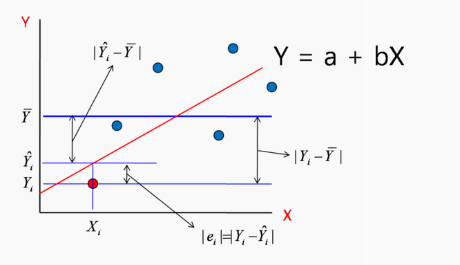

## 1. 선형 회귀의 기본 가정

***
선형 회귀는 종속 변수 ${Y}_{i}$와 독립변수 ${X}_{i1}$, ${X}_{i2}$, ..., ${X}_{ip}$를 다음과 같은 선형식으로 표현한다. ${\beta}_{p}$는 회귀 모델의 계수이며, ${\varepsilon}_{i}$는 오차(error)다.

$$
{Y }_{ i }={ \beta  }_{ 0 } + { \beta  }_{ 1 }{ X }_{ i1 } + ... + { \beta  }_{ p }{ X }_{ ip } + { \varepsilon  }_{ i }
\quad\quad\quad(식 8.1)
$$ 

이러한 선형모델이 유용한 경우는 브레이크를 밟기 전의 주행속도와 제동거리간의 관계, 아버지와 아들의 키의 관계 등이 있다.
위의 식에서 선형 회귀는 일반적으로 다음과 같은 내용을 가정한다.

* 종속 변수와 독립 변수들간의 관계는 식8-1과 같은 선형성이 성립한다.
* 독립 변수는 정확히 측정된 값으로 고정된 값이다.
* 오차는 평균이 0, 분산은 ${\sigma}^{2}$ 인 정규분포를 따르며 모든 i에 대해 평균과 분산이 일정하다. 서로 다른 i, j에 대해 ${\varepsilon}_{i}$, ${\varepsilon}_{j}$는 독립이다.
* 독립 변수간에는 다중 공선성이 적어야 한다. 다중 공선성은 회귀 모델에서 변수 간의 상관관계가 커서 한 변수를 다른 변수들의 선형 조합으로 손쉽계 예측하는 경우를 뜻한다.


## 2. 단순 선형 회귀
***
단순 선형 회귀는 종속 변수를 하나의 독립 변수로 설명한다. 두 개 이상의 독립 변수로 설명하는 경우는 중선형 회귀라 한다. 단순 선형 회귀 모델은 다음과 같이 표현된다. 
$$
{Y}_{i}={ \beta  }_{ 0 } + { \beta  }_{ 1 }{ X }_{ i } + { \varepsilon  }_{ i }
$$ 

```{r}
(m <- lm(dist ~ speed, cars))
```

$$
dist = -17.759 + 3.932 x speed + {\varepsilon}
$$

### 선형 회귀 결과 추출
***
#### 회귀 계수: coef(model)
```{r}
coef(m)
```

***
#### 적합된 값: fitted(model)
모델에 의해 예측된 종속변수의 값을 보여주며, 모델이 데이터에 적합된 결과이므로 적합된 값이라고 부른다.
```{r}
fitted(m)[1:4]
```

***
#### 잔차: residuals(model)
식8-1에서 오차는 이론적인 값을 부르는 명칭, 모델로부터 구한 예측값과 살제 값 사이의 차이는 잔차라고 부른다.
```{r}
residuals(m)[1:4]
```

```{r}
fitted(m)[1:4] + residuals(m)[1:4]
cars$dist[1:4]
```

***
#### 회귀 계수의 신뢰 구간: confint(model)
단순 선형 회귀에서 절편과 speed의 기울기는 정규 분포를 따른다. 따라서 t 분포를 사용한 신뢰구간을 confint(model)을 사용해 구할 수 있다.
```{r}
confint(m)
```

***
#### 잔차 제곱 합
잔차 제곱 합 $\sum { { \varepsilon  }_{ i }^{ 2 } }$은 다음과 같이 구한다.
```{r}
deviance(m)
```
선형 회귀의 회귀 계수는 최소 제곱법으로 추정하며, 이 경우 오차의 제곱합이 최소가 되도록 회귀 계수를 정한다. 이 때문에 잔체 제곱 합은 데이터와 추정된 모델간의 불일치 정도를 표현하는 것으로 볼 수 있다.

***
### 예측과 신뢰 구간
lm()을 통해 모델을 만들고, predict()로 새로운 데이터에 대한 예측을 한다. 내부적으로는 predict.lm()이 호출된다.
```{r}
(m <- lm(dist ~ speed, data=cars))
predict(m, newdata=data.frame(speed=3))
```

회귀 계수의 신뢰구간을 고려하기 위해 type="confidence"를 지정하면 제동 거리의 평균 신뢰 구간을 구할 수 있다. 이 경우 오차의 평균은 0으로 가정한다. 
```{r}
predict(m, newdata=data.frame(speed=c(3)), interval="confidence")
```
특정 속도를 가진 차량 한 대가 주어졌을때 해당 차량에 대해 제동거리를 생각한다면 오차를 무시할 수 없다. 이 경우 type="prediction"을 사용해 예측 구간을 구한다.
```{r}
predict(m, newdata=data.frame(speed=c(3)), interval="prediction")
```

***
### 모델 평가
선형 회귀 모델을 살펴보는 주요 함수는 summary()다. 기계 학습 모델이나 통계 모델을 인자로 주면 각 모델의 요약 정보를 알려준다.
```{r}
summary(m)

```
결정 계수(R-squared)와 수정 결정 계수(Adjusted R-squared)는 모델의 데이터 분산 정도를 가리키며, F 통계량은 모델이 통계적으로 얼마나 의미가 있는지를 알려준다. 

***
#### 결정 계수와 F 통계량
결정 계수는 총변동(SST) 중에서 회귀변동(SSR)이 차지하는 비율(${R}^{2}$), X와 Y간의 상관관계가 클수록 1에 가까워짐. 서로 다른 개수의 독립 변수를 사용하는 모델 간의 비교를 위해서는 ${R}^{2}$을 자유도로 나눈 수정 결정 계수를 더 많이 사용한다.


***
### 분산 분석 및 모델 간의 비교
선형 회귀에서 분산 분석은 모델을 평가하거나 모델 간의 비교를 위해 anova() 함수를 사용.
```{r}
anova(m)
(full <- lm(dist ~ speed, data=cars))
(reduced <- lm(dist ~ 1, data=cars))
anova(reduced, full)
```

***
### 모델 진단 그래프
일반 함수인 plot(m) 명령(plot.lm() 호출)으로 선형 회귀 모델을 평가하는데 다양한 차트를 볼 수 있다.
```{r}
plot(m)
```

의문점
* 네 번째 차트에서 leverage의 의미?
* cook distance?


첫 번째 그래프는 관측값의 순서별 쿡의 거리, 두 번째 차트는 레버리지와 쿡의 거리를 보여준다.
```{r}
plot(m, which=c(4, 6))

```

### 회귀 직선의 시각화
데이터의 산점도와 회귀 직선은 plot()을 사용해 그릴 수 있다. coef()는 선형 회귀 모델의 절편과 기울기를 추출하는 함수며, abline()은 주어진 절편과 기울기로 그래프를 그리는 함수다.

```{r}
plot(cars$speed, cars$dist)
abline(coef(m))

```

다음은 그래프에 추정값의 신뢰 구간을 표현하는 방법이다.
```{r}
summary(cars$speed)
predict(m, newdata=data.frame(speed=seq(4.0, 25.0, .2)),
        interval="confidence")

```

```{r}
speed <- seq(min(cars$speed), max(cars$speed), .1)
ys <- predict(m, newdata=data.frame(speed=speed), interval="confidence")
matplot(speed, ys, type='n')
matlines(speed, ys, lty=c(1, 2, 2), col=1)

```


## 3. 중선형 회귀
***
하나 이상의 독립 변수가 사용된 선형 회귀. 

***
#### 모델 생성 및 평가
```{r}
(m <- lm(Sepal.Length ~ Sepal.Width + Petal.Length + Petal.Width, data=iris))
summary(m)

```
위의 결과에서 독립변수의 p값이 모두 0.05보다 작아 모두 중요한 변수이다. 중선형 회귀에서 귀무가설은 '모든 계수가 0이다'이다. 따라서 F 통계량에서 p-value < 0.05이기 때문에 하나 이상의 독립 변수의 계수가 0이 아니다.

***
#### 범주형 변수
다음은 범주형 변수인 Species를 포함한 중선형 회귀다.
```{r}
(m <- lm(Sepal.Length ~ ., data=iris))
summary(m)
```
위의 결과에서 setosa가 없는 이유는 범주형 변수를 가변수를 사용해 표현했기 때문이다.


표현하고자 하는 Species  | Speciesversicolor  | Speciesvirginica 
--- | --- | --- |
setosa  | 0  |  0 |
versicolor | 1  |  0 |
virginica  | 0 |  1 |

```{r}
model.matrix(m)[c(1,51,101),]

```

***
#### 중선형 회귀 모델의 시각화

```{r}
with(iris, plot(Sepal.Width, Sepal.Length, cex=.7, pch=as.numeric(Species)))
m <- lm(Sepal.Length ~ Sepal.Width + Species, data=iris)
coef(m)
abline(2.25, 0.80, lty=1)
abline(2.25 + 1.45, 0.80, lty=2)
abline(2.25 + 1.94, 0.80, lty=3)
legend("topright", levels(iris$Species), pch=1:3, bg="white")
```

***
#### 표현식을 위한 l()의 사용
2차 이상이나 두 변수의 합을 하나의 변수로 보고 회귀 분석할때 I()안에 원하는 수식을 표현한다. I()는 객체의 해석과 변환을 방지한다.
```{r}
x <- 1:1000
y <- x^2 + 3*x + 5 + rnorm(1000)
lm(y ~ I(x^2) + x)
```

***
#### 변수의 변환
```{r}
x <- 101:200
y <- exp(3 * x + rnorm(100))
lm(log(y) ~ x)
```

***
#### 상호작용
상호 작용은 독립 변수 간의 상호 작용이 종속 변수에 영향을 주는 경우를 말한다. 이 영향을 주는 방법은 합이 아니라 곱의 형태일때를 말한다.
```{r}
data(Orange)
Orange
with(Orange, plot(Tree, circumference, xlab="tree", ylab="circumference"))
# 상호 작용 그래프
with(Orange, interaction.plot(age, Tree, circumference))
# Tree 열의 데이터를 순서 없는 명목형 변수로 변환
Orange[,"fTree"] <- factor(Orange[, "Tree"], ordered=FALSE)
# fTree, age, fTree:age를 설명 변수로 선형 회귀를 수행
m <- lm(circumference ~ fTree * age, data=Orange)
anova(m)
head(model.matrix(m))
mm <- model.matrix(m)
# age가 포함된 열만 추출
mm[, grep("age", colnames(mm))]
```

## 4. 이상치
***
이상치는 주어진 회귀 모델에 대해 의해 잘 설명되지 않는 데이터 점들을 뜻한다. 이상치 검출에는 잔차, 특히 외면 스튜던트화 잔차(잔차를 잔차의 표준 편차로 나눈 값)를 사용한다. 이 잔차는 i번째 데이터는 제외하고 표준편차를 구한다.
```{r}
data(Orange)
m <- lm(circumference ~ age + I(age^2), data=Orange)
rstudent(m)
```

Orange에 이상치를 추가하고 앞선 포뮬러로 선형 회귀를 수행한 다음 outlierTest(본페로니 이상값 검정)를 호출해 이상치를 찾아보자.
```{r}
data(Orange)
Orange <- rbind(Orange, data.frame(Tree=as.factor(c(6,6,6)),
                                   age=c(118, 484, 664),
                                   circumference=c(177, 50, 30)))
tail(Orange)
m <- lm(circumference ~ age + I(age^2), data=Orange)
library(car)
outlierTest(m)
```

## 5. 변수 선택
***
변수의 통계적 특성을 고려해 기계적으로 설명 변수를 채택하는 방법이 있다.

***
### 변수 선택 방법
특정 기준(F통계량 이나 AIC:모델의 상대적 품질을 평가하는 척도, 값이 낮을수록 좋음)를 사용해 변수를 하나씩 택하거나 제거한다.
* 전진 선택법: 절편만 있는 모델에서 기준 통계치를 가장 많이 개선시키는 변수를 차례로 추가
* 변수 소거법: 모든 변수가 포함된 모델에서 기준 통계치에 가장 도움이 되지 않는 변수를 하나씩 제거하는 방법.
* 단계적 방법: 기준 통계치에 도움이 되지 않는 변수를 삭제하거나, 도움이 되는 변수를 추가한다.

```{r}
library(mlbench)
data(BostonHousing)
m <- lm(medv ~ ., data=BostonHousing)
m2 <- step(m, direction="both")
formula(m2)
```

***
### 모든 경우에 대한 비교
N개의 설명 변수가 있을 때 각 변수를 추가하거나 뺀 총 2N개의 회귀 모델을 만들고 이들 모두를 비교하는 방법이 있다.
```{r}
library(leaps)
library(mlbench)
data(BostonHousing)
m <- regsubsets(medv ~ ., data=BostonHousing)
summary(m)
# BIC (작을수록 좋음)
summary(m)$bic
# 수정 결정 계수 (높을수록 좋음)
summary(m)$adjr2
plot(m, scale="adjr2")
```


